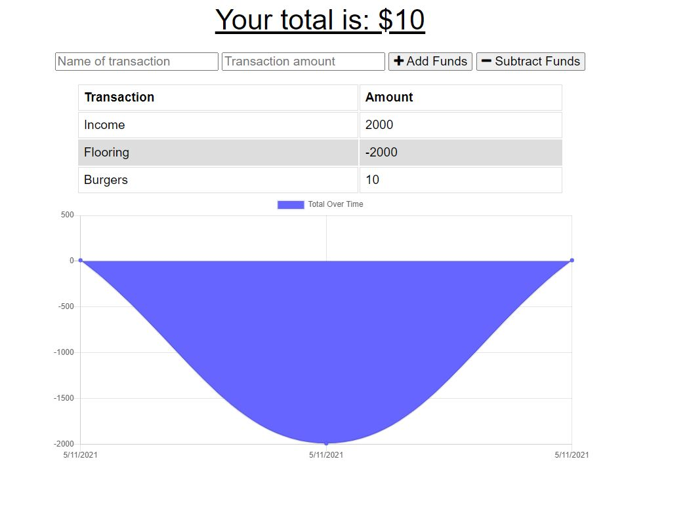

# Unit-18-PWA-Homework

Unit 18 PWA Homework - Online/Offline Budget Trackers

[Link to deployed app](https://tony-budget-tracker.herokuapp.com/)
(Click to open app)

GitHub Repo: https://github.com/tonyrpark/18-PWA-Homework-Budget-Tracker

## Table of contents

- [General info](#general-info)
- [User Story](#user-story)
- [Instruction](#instructions)
- [Business Context](#business-contect)
- [Acceptance Criteria](#acceptance)
- [Screenshots](#screenshots)
- [Features](#features)

## General info

A simple budget tracker that can add or subtract transactions and display chart over several days.

## User Story

AS AN avid traveller
I WANT to be able to track my withdrawals and deposits with or without a data/internet connection
SO THAT my account balance is accurate when I am traveling

## Business Context

Giving users a fast and easy way to track their money is important, but allowing them to access that information anytime is even more important. Having offline functionality is paramount to our applications success.

## Screenshots

## Features

Offline Functionality:

- Enter deposits offline
- Enter expenses offline

When brought back online:

- Offline entries should be added to tracker.

Tony Park 2021
